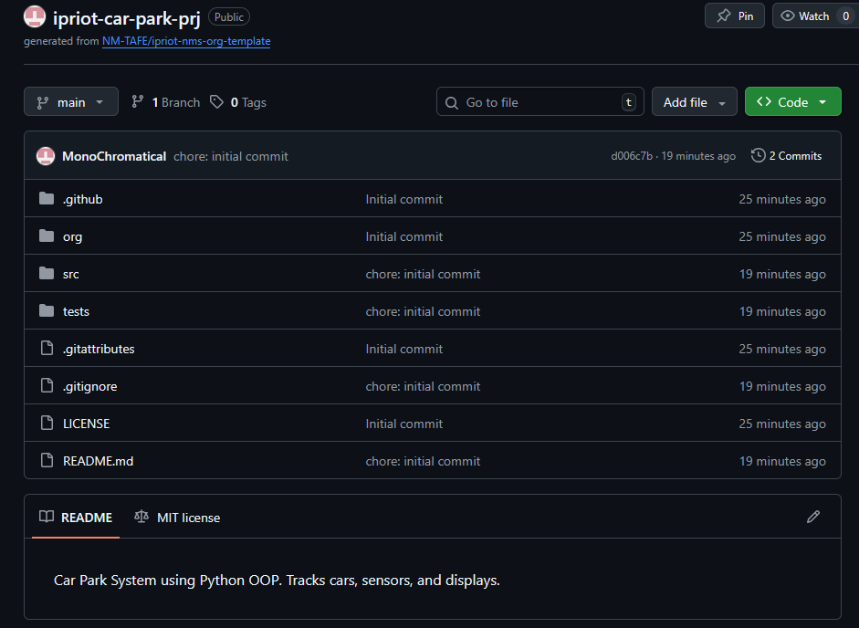
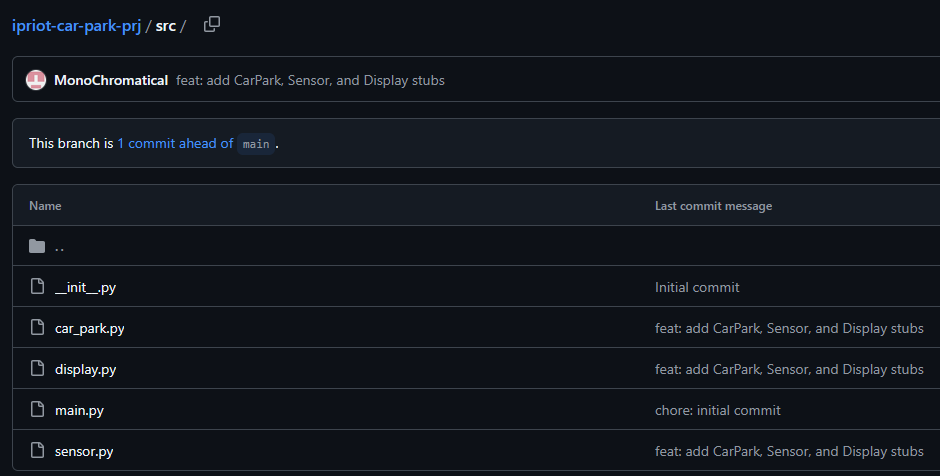
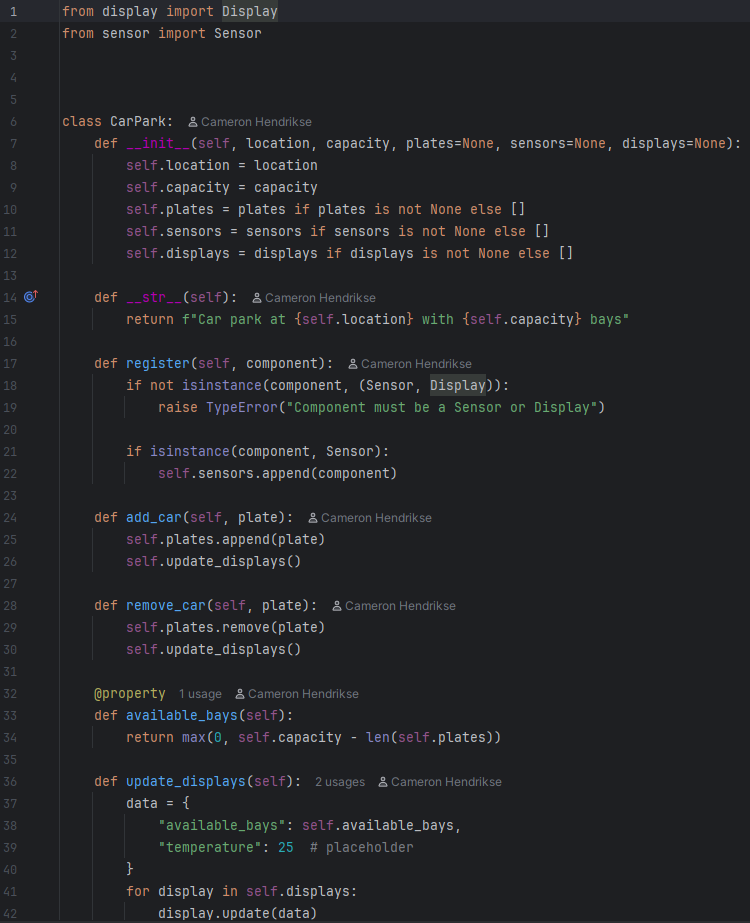
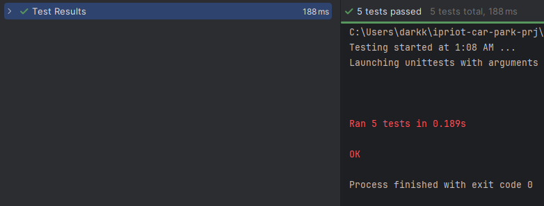
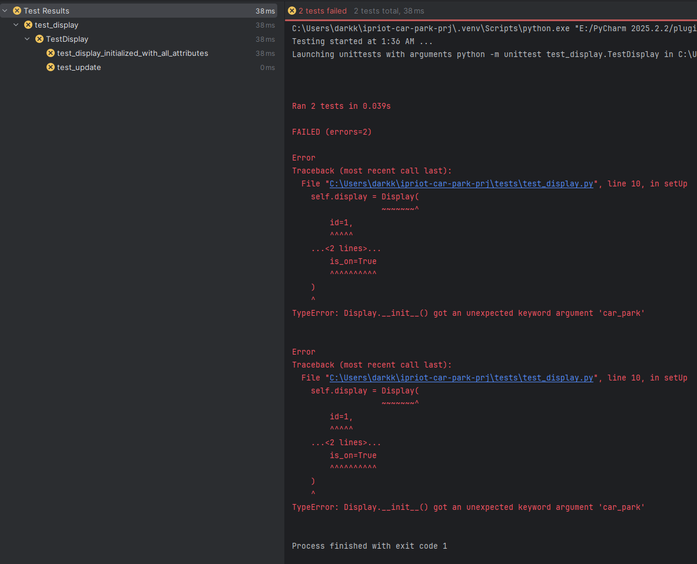

Car Park System using Python OOP. Tracks cars, sensors, and displays.

Screenshot evidence

First commit

src folder after second commit

Git tag evidence

Screenshot of CarPark with the new methods

Unit test - test_car_park

Unit test - test_display (Errors)

Unit test - test_display (Error correction)

ANSWERS Identify classes, methods, and attributes

| Class Name | Attributes                           | Methods                                                             |
| ---------- |--------------------------------------|---------------------------------------------------------------------|
| `CarPark`    | Location, capacity, plates, displays | register(), add_car(), remove_car(), update_displays(), available_bays() |
| `Sensor`     | id, is_active, car_park              | detect_vehicle(), _scan_plate(), update_car_park()                  |
| `Display`    | id, message, is_on                   | update()                                                            |

    Answer the following questions:

    Which class is responsible for each of the following pieces of information (and why)?
            The number of available bays Answer here...

The CarPark class is responsible for the number of available bays.

The number of available bays depends on the car park’s capacity and the cars currently inside (the `plates` list). 
Both of these are stored and managed by the CarPark class. Because the CarPark knows how many cars are in it and how 
many bays it has, it should calculate and expose `available_bays`.

            The current temperature Answer here...

The CarPark class is responsible for the current temperature.

In this system, the CarPark acts as the central controller that gathers information and sends it to the displays.
The Display class is only responsible for showing information, not generating it. The Sensor classes are focused on 
detecting vehicles. Since the CarPark already prepares the status data for displays, it makes sense for it to also 
provide the temperature.

            The time Answer here...

The CarPark class is responsible for the time.

The time is part of the status information that drivers see along with available bays and temperature. Displays only
present data they are given, and Sensors only detect vehicles. The CarPark class is responsible for assembling the
information that will be sent to each Display, so it is the most appropriate class to provide the current time.

        What is the difference between an attribute and a property? Answer here...

An attribute is a value stored directly on an object, like `self.location` or `self.capacity`. We set it in `__init__`,
and we access it directly, e.g. `car_park.location`.

A property is a method that is made to look like an attribute using the `@property` decorator. It usually calculates a
value instead of storing it directly. For example, `available_bays` is a property that calculates `capacity - number of plates`,
but we access it like `car_park.available_bays` (without brackets)

        Why do you think we used a dictionary to hold the data we passed the display? List at least one advantage
        and one disadvantage of this approach. Answer here...

Advantage:
A dictionary makes it easy to send different pieces of related information together under named keys. For example:

data = {"available_bays": 50, "temperature": 25}

The display can look up values by name, and we can add more fields later (like "time") without changing the method
signature.

Disadvantage: 
Because a dictionary is not strongly typed, it's easy to make mistakes like typing a key name wrong (`"availble_bays"` 
instead of `"available_bays"`). These errors only show up at runtime and can be harder to find compared to using
explicit parameters.

    The car park register method should accept a Sensor (optional) or Display object. It should raise a TypeError if the 
    object is neither a Sensor nor a Display. Before proceeding, think about where you would test this behaviour. Should
    you test it in the CarPark unit tests or the Display/Sensor unit tests? Why?

The `register` method belongs to the CarPark class, and it is part of the CarPark’s behaviour.

So the test for “register raises `TypeError` when given an invalid object” should be written in the CarPark unit tests 
(`test_car_park.py`), not in the Display or Sensor tests.

This is because we are testing how CarPark reacts to bad input, not how Display or Sensor behave.

